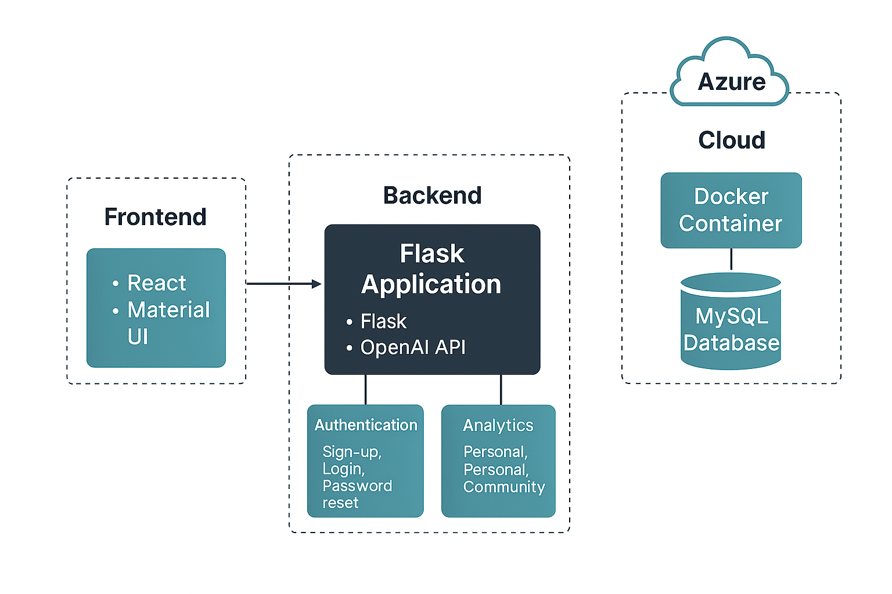

# JobTrackr

**Smart AI-powered job application tracker built with Flask and React**

## 🚀 Overview

JobTrackr helps users manage, track, and optimize their job hunt using AI-generated resumes and cover letters, real-time analytics, and a personalized dashboard. Built by Team Infinity 5tack for the CLO900 Capstone Project at Seneca Polytechnic.

---

## 🧱 Architecture



---

## 🧩 Features

- 🔐 Secure sign-up, login, and password reset with OTP
- 📄 AI-powered resume and cover letter generation 
- 🧑‍💼 Multi-step user profile setup
- 📊 Dashboard with personal and community analytics
- 🔍 Job search via Adzuna & Jooble APIs
- 💼 Job tracker with status updates and filtering
- 🧠 Company research tool 
- 📦 Fully containerized using Docker
- ☁️ Deployed on Azure with CI/CD

---

## 🛠️ Tech Stack

| Layer       | Tools Used                      |
|-------------|----------------------------------|
| Frontend    | React, Material UI, Tailwind CSS |
| Backend     | Python Flask, OpenAI API         |
| Database    | MySQL on Azure                   |
| Cloud       | Azure (App Service, DB)          |
| DevOps      | GitHub Actions + Docker          |

---

## Team Members

| Name                   | Role                           |
|------------------------|--------------------------------|
| **Poonam Agarwal**     | Backend Developer (Auth, APIs) |
| **Dhairya Soni**       | Resume Generator, DB Mapping   |
| **Krishna Katira**     | Frontend Lead, UI/UX           |
| **Smriti Banjade**     | Cover Letter & Job Search UI   |
| **Ishan Sohal**        | DevOps & Cloud Deployment      |

---

## ✅ Testing

- 🧪 **Manual Testing**: Every user flow was tested manually — including sign-up, login, profile creation, job tracking, analytics, and AI features.
- 📬 **API Testing**: Postman was used to rigorously test all backend endpoints, including auth, profile, job tracking, and analytics.
- 🧾 [Click here to view API QA Test Cases (CSV)](./JobTrackr__QA_Test_Cases.csv)
- 🧪 [Functional Manual Test Cases](./TEST_CASES.md)

---

## 📁 Project Structure

```bash
├── Backend/
│   ├── app.py
│   ├── run.py
│   ├── requirements.txt
│   └── tables.sql
│
├── Frontend/
│   ├── public/
│   ├── src/api
        ├── /api
        ├── /components
        ├── /pages
│   └── tailwind.config.js
│
├── Cloud/
│   ├── backend/
│   └── frontend/
│
├── JobTrackr_Architecture.png
├── JobTrackr__QA_Test_Cases.csv
├── TEST_CASES.md
└── README.md


